Publication-ready volcano plots with enhanced colouring and labeling
================
Kevin Blighe
2019-01-21

-   [Introduction](#introduction)
-   [Installation](#installation)
    -   [1. Download the package from Bioconductor](#download-the-package-from-bioconductor)
    -   [2. Load the package into R session](#load-the-package-into-r-session)
-   [Quick start](#quick-start)
    -   [Plot the most basic volcano plot](#plot-the-most-basic-volcano-plot)
-   [Advanced features](#advanced-features)
    -   [Modify cut-offs for log2FC and P value; add title; adjust point and label size](#modify-cut-offs-for-log2fc-and-p-value-add-title-adjust-point-and-label-size)
    -   [Adjust colour and alpha for point shading](#adjust-colour-and-alpha-for-point-shading)
    -   [Adjust axis limits](#adjust-axis-limits)
    -   [Adjust cut-off lines](#adjust-cut-off-lines)
    -   [Adjust legend position, size, and text](#adjust-legend-position-size-and-text)
    -   [Plot adjusted p-values](#plot-adjusted-p-values)
    -   [Fit more labels by adding connectors](#fit-more-labels-by-adding-connectors)
    -   [Only label key transcripts](#only-label-key-transcripts)
    -   [Modify border and remove gridlines](#modify-border-and-remove-gridlines)
    -   [Plot multiple volcanos on the same page](#plot-multiple-volcanos-on-the-same-page)
    -   [Override colouring scheme with custom key-value pairs](#override-colouring-scheme-with-custom-key-value-pairs)
    -   [Shade certain transcripts](#shade-certain-transcripts)
-   [Acknowledgments](#acknowledgments)
-   [Session info](#session-info)
    -   [References](#references)

Introduction
============

Volcano plots represent a useful way to visualise the results of differential expression analyses. Here, we present a highly-configurable function that produces publication-ready volcano plots (Blighe 2018). EnhancedVolcano will attempt to fit as many transcript names in the plot window as possible, thus avoiding 'clogging' up the plot with labels that could not otherwise have been read.

Installation
============

1. Download the package from Bioconductor
-----------------------------------------

``` r
    if (!requireNamespace("BiocManager", quietly = TRUE))
        install.packages("BiocManager")
        BiocManager::install("EnhancedVolcano")
```

Note: to install development version:

``` r
    devtools::install_github("kevinblighe/EnhancedVolcano")
```

2. Load the package into R session
----------------------------------

``` r
    library(EnhancedVolcano)
```

Quick start
===========

For this example, we will follow the tutorial (from Section 3.1) of [RNA-seq workflow: gene-level exploratory analysis and differential expression](http://master.bioconductor.org/packages/release/workflows/vignettes/rnaseqGene/inst/doc/rnaseqGene.html). Specifically, we will load the 'airway' data, where different airway smooth muscle cells were treated with dexamethasone.

``` r
    library(airway)
    library(magrittr)

    data("airway")
    airway$dex %<>% relevel("untrt")
```

Conduct differential expression using DESeq2 in order to create 2 sets of results:

``` r
    library("DESeq2")

    dds <- DESeqDataSet(airway, design = ~ cell + dex)
    dds <- DESeq(dds, betaPrior=FALSE)
    res1 <- results(dds,
        contrast = c("dex","trt","untrt"))
    res1 <- lfcShrink(dds,
        contrast = c("dex","trt","untrt"), res=res1)
    res2 <- results(dds,
        contrast = c("cell", "N061011", "N61311"))
    res2 <- lfcShrink(dds,
        contrast = c("cell", "N061011", "N61311"), res=res2)
```

Plot the most basic volcano plot
--------------------------------

For the most basic volcano plot, only a single data-frame or -matrix of test results is required, containing transcript names, log2FC, and adjusted or unadjusted P values. The default cut-off for log2FC is &gt;|2|; the default cut-off for P value is 0.05.

``` r
    EnhancedVolcano(res1,
        lab = rownames(res1),
        x = "log2FoldChange",
        y = "pvalue")
```

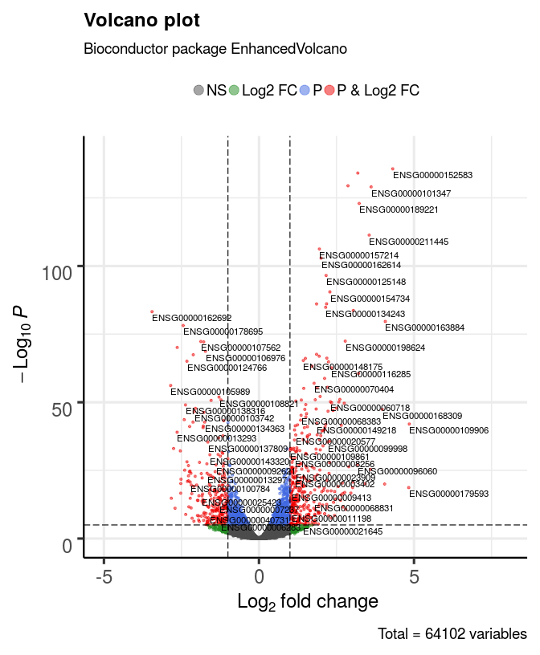

Advanced features
=================

Virtually all aspects of an EnhancedVolcano plot can be configured for the purposes of accommodating all types of statistical distributions and labelling preferences. EnhancedVolcano will only attempt to label genes that pass the thresholds that you set for statistical significance, i.e., 'pCutoff' and 'FCcutoff'. In addition, it will only label as many of these that can reasonably fit in the plot space. The user can optionally supply a vector of transcript names (as 'selectLab') that s/he wishes to label in the plot.

Modify cut-offs for log2FC and P value; add title; adjust point and label size
------------------------------------------------------------------------------

The default P value cut-off of 0.05 may be too relaxed for most studies, which may therefore necessitate increasing this threshold by a few orders of magnitude. Equally, the log2FC cut-offs may be too stringent, given that moderated 'shrunk' estimates of log2FC differences in differential expression analysis can now be calculated.

In this example, we also modify the point and label size, which can help to improve clarity where many transcripts went into the differential expression analysis.

``` r
    EnhancedVolcano(res2,
        lab = rownames(res2),
        x = "log2FoldChange",
        y = "pvalue",
        pCutoff = 10e-12,
        FCcutoff = 1.5,
        transcriptPointSize = 1.5,
        transcriptLabSize = 3.0,
        title = "N061011 versus N61311")
```

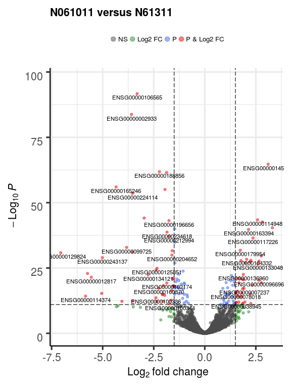

Adjust colour and alpha for point shading
-----------------------------------------

The default colour scheme may not be to everyone's taste. Here we make it such that only the transcripts passing both the log2FC and P value thresholds are coloured red, with everything else black. We also adjust the value for 'alpha', which controls the transparency of the plotted points: 1 = 100% opaque; 0 = 100% transparent.

``` r
    EnhancedVolcano(res2,
        lab = rownames(res2),
        x = "log2FoldChange",
        y = "pvalue",
        pCutoff = 10e-12,
        FCcutoff = 1.5,
        transcriptPointSize = 1.5,
        transcriptLabSize = 3.0,
        title = "N061011 versus N61311",
        col=c("black", "black", "black", "red3"),
        colAlpha = 1)
```

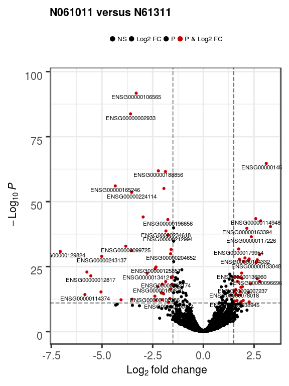

Adjust axis limits
------------------

The x-axis limits for log2FC defaults to the max and min of the log2FC values passed to EnhancedVolcano. This can often render the plot asymmetrical; so, the user may wish to set these axis limits to the same absolute values, e.g., c(-8, 8). One can also modify the y-axis limits, but this should be a less common occurrence.

``` r
    EnhancedVolcano(res2,
        lab = rownames(res2),
        x = "log2FoldChange",
        y = "pvalue",
        pCutoff = 10e-12,
        FCcutoff = 1.5,
        transcriptPointSize = 1.5,
        transcriptLabSize = 3.0,
        title = "N061011 versus N61311",
        colAlpha = 1,
        xlim = c(-8, 8),
        ylim = c(0, -log10(10e-32)))
```

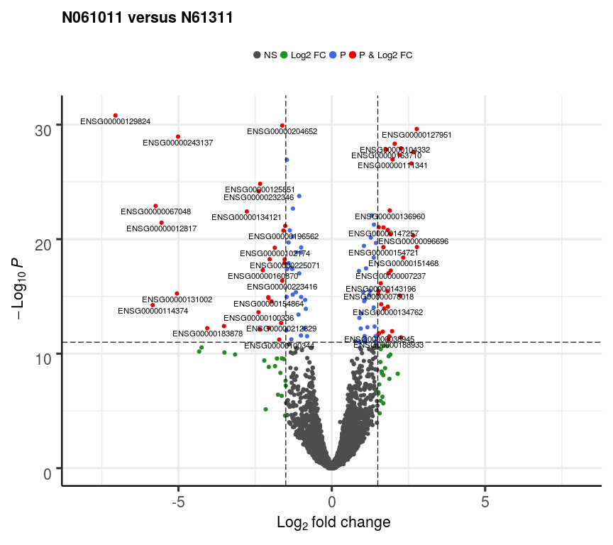

Adjust cut-off lines
--------------------

The lines that are drawn to indicate cut-off points are also modifiable. The parameter 'cutoffLineType' accepts the following values: "blank", "solid", "dashed", "dotted", "dotdash", "longdash", and "twodash". The colour and thickness of these can also be modified with 'cutoffLineCol' and 'cutoffLineWidth'. To disable the lines, set either cutoffLineType="blank" or cutoffLineWidth=0.

``` r
    EnhancedVolcano(res2,
        lab = rownames(res2),
        x = "log2FoldChange",
        y = "pvalue",
        pCutoff = 10e-12,
        FCcutoff = 1.5,
        transcriptPointSize = 1.5,
        transcriptLabSize = 3.0,
        title = "N061011 versus N61311",
        colAlpha = 1,
        xlim = c(-6, 6),
        cutoffLineType = "twodash",
        cutoffLineCol = "pink",
        cutoffLineWidth = 1.5)
```


Adjust legend position, size, and text
--------------------------------------

The position of the legend can also be changed to "left" or "right" (and stacked vertically), or "top" or "bottom" (stacked horizontally). The legend text, label size, and icon size can also be modified.

``` r
    EnhancedVolcano(res2,
        lab = rownames(res2),
        x = "log2FoldChange",
        y = "pvalue",
        pCutoff = 10e-12,
        FCcutoff = 1.5,
        transcriptPointSize = 1.5,
        transcriptLabSize = 3.0,
        colAlpha = 1,
        xlim = c(-6, 6),
        cutoffLineType = "twodash",
        cutoffLineWidth = 2.0,
        legend=c("NS","Log (base 2) fold-change","P value",
            "P value & Log (base 2) fold-change"),
        legendPosition = "right",
        legendLabSize = 14,
        legendIconSize = 5.0)
```

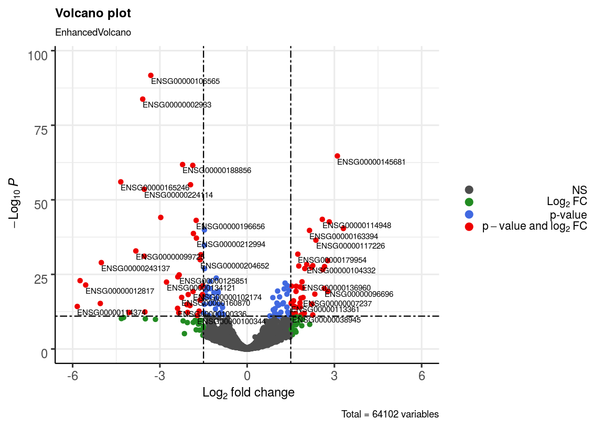

Note: to make the legend completely invisible, specify:

``` r
legendVisible = FALSE
```

Plot adjusted p-values
----------------------

Volcano plots do not have to be plotted with nominal (unadjusted P values). Simply provide a column name relating to adjusted P values and you can also generate a volcano with these. In this case, the cutoff for the P value then relates to the adjusted P value. Here, we also modify the axis titles by supplying an expression via the bquote function.

``` r
    EnhancedVolcano(res2,
        lab = rownames(res2),
        x = "log2FoldChange",
        y = "padj",
        xlab = bquote(~Log[2]~ "fold change"),
        ylab = bquote(~-Log[10]~adjusted~italic(P)),
        pCutoff = 0.0001,
        FCcutoff = 1.0,
        xlim=c(-6,6),
        transcriptLabSize = 3.0,
        colAlpha = 1,
        legend=c("NS","Log2 FC","Adjusted p-value",
            "Adjusted p-value & Log2 FC"),
        legendPosition = "bottom",
        legendLabSize = 10,
        legendIconSize = 3.0)
```


Fit more labels by adding connectors
------------------------------------

In order to maximise free space in the plot window, one can fit more transcript labels by adding connectors from labels to points, where appropriate. The width and colour of these connectors can also be modified with widthConnectors and colConnectors, respectively.

The result may not always be desirable as it can make the plot look overcrowded.

``` r
    EnhancedVolcano(res2,
        lab = rownames(res2),
        x = "log2FoldChange",
        y = "padj",
        xlab = bquote(~Log[2]~ "fold change"),
        ylab = bquote(~-Log[10]~adjusted~italic(P)),
        pCutoff = 0.0001,
        FCcutoff = 2.0,
        xlim = c(-6,6),
        transcriptLabSize = 3.0,
        colAlpha = 1,
        legend=c("NS","Log2 FC","Adjusted p-value",
            "Adjusted p-value & Log2 FC"),
        legendPosition = "bottom",
        legendLabSize = 10,
        legendIconSize = 3.0,
        drawConnectors = TRUE,
        widthConnectors = 0.2,
        colConnectors = "grey30")
```

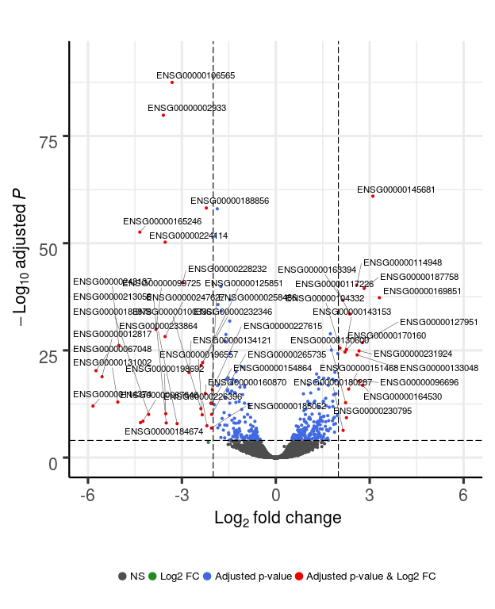

Only label key transcripts
--------------------------

In many situations, people may only wish to label their key transcripts / transcripts of interest. One can therefore supply a vector of these transcripts via the 'selectLab' parameter, the contents of which have to also be present in the vector passed to 'lab'. In addition, only those transcripts that pass both the cutoff for log2FC and P value will be labelled.

``` r
    EnhancedVolcano(res2,
        lab = rownames(res2),
        x = "log2FoldChange",
        y = "padj",
        selectLab = c("ENSG00000106565","ENSG00000187758"),
        xlab = bquote(~Log[2]~ "fold change"),
        ylab = bquote(~-Log[10]~adjusted~italic(P)),
        pCutoff = 0.0001,
        FCcutoff = 2.0,
        xlim = c(-6,6),
        transcriptPointSize = 1.8,
        transcriptLabSize = 5.0,
        colAlpha = 1,
        legend=c("NS","Log2 FC","Adjusted p-value",
            "Adjusted p-value & Log2 FC"),
        legendPosition = "bottom",
        legendLabSize = 10,
        legendIconSize = 3.0)
```

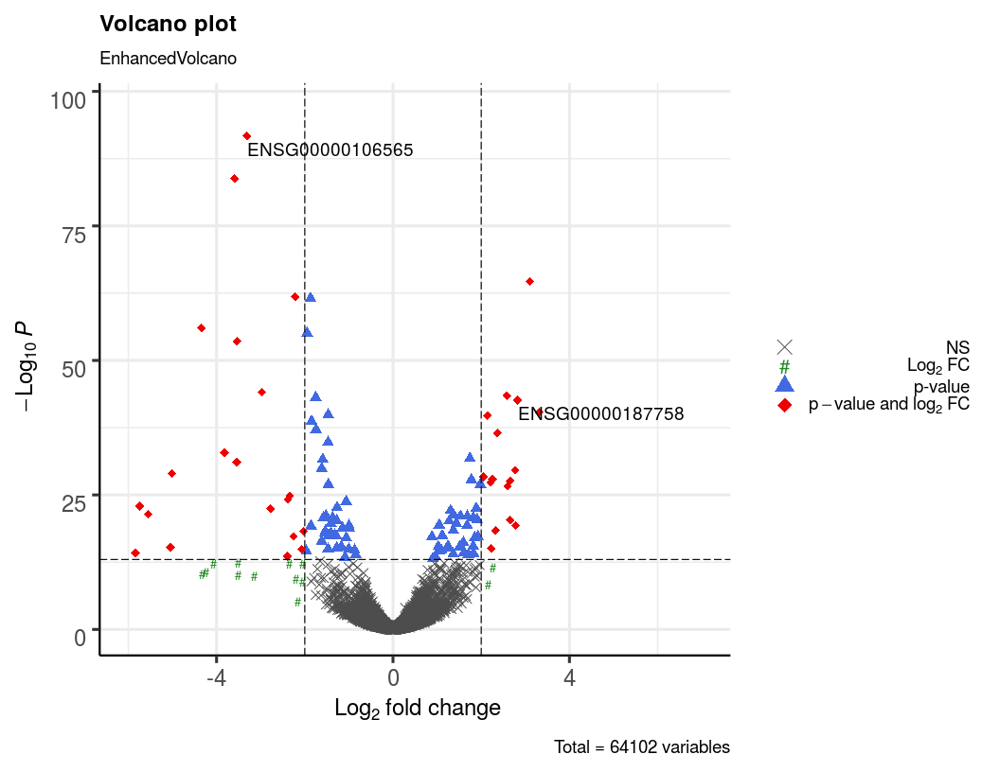

Modify border and remove gridlines
----------------------------------

One can also modify the border by adding a complete border around the entire plot, and also its width and colour. The gridlines can also be removed.

``` r
    EnhancedVolcano(res2,
        lab = rownames(res2),
        x = "log2FoldChange",
        y = "padj",
        selectLab = c("ENSG00000106565","ENSG00000187758"),
        xlab = bquote(~Log[2]~ "fold change"),
        ylab = bquote(~-Log[10]~adjusted~italic(P)),
        pCutoff = 0.00000000000000001,
        FCcutoff = 2.0,
        xlim = c(-6,6),
        transcriptLabSize = 3.0,
        colAlpha = 1,
        legend=c("NS","Log2 FC","Adjusted p-value",
            "Adjusted p-value & Log2 FC"),
        legendPosition = "bottom",
        legendLabSize = 10,
        legendIconSize = 3.0,
        drawConnectors = FALSE,
        border = "full",
        borderWidth = 1.5,
        borderColour = "black",
        gridlines.major = FALSE,
        gridlines.minor = FALSE)
```

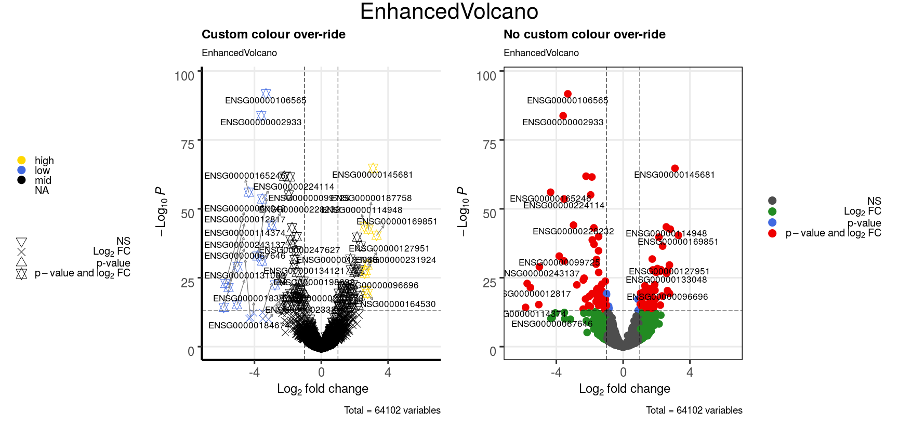

Plot multiple volcanos on the same page
---------------------------------------

One can also plot multiple volcanos on the same plot via the use of the grid and gridExtra packages.

``` r
    p1 <- EnhancedVolcano(res1,
        lab = rownames(res1),
        x = "log2FoldChange",
        y = "pvalue",
        pCutoff = 10e-24,
        FCcutoff = 2.0,
        xlim = c(-6.5,6.5),
        transcriptLabSize = 5.0,
        colAlpha = 1,
        legendPosition = "bottom",
        legendLabSize = 10,
        legendIconSize = 3.0)

    p2 <- EnhancedVolcano(res2,
        lab = rownames(res2),
        x = "log2FoldChange",
        y = "padj",
        selectLab = c("ENSG00000106565","ENSG00000187758"),
        xlab = bquote(~Log[2]~ "fold change"),
        ylab = bquote(~-Log[10]~adjusted~italic(P)),
        pCutoff = 0.0001,
        FCcutoff = 2.0,
        xlim = c(-6.5,6.5),
        transcriptLabSize = 5.0,
        colAlpha = 1,
        legend=c("NS","Log2 FC","Adjusted p-value",
            "Adjusted p-value & Log2 FC"),
        legendPosition = "bottom",
        legendLabSize = 10,
        legendIconSize = 3.0)

    library(gridExtra)
    library(grid)
    grid.arrange(p1, p2, ncol=2, top="EnhancedVolcano")
    grid.rect(gp=gpar(fill=NA))
```

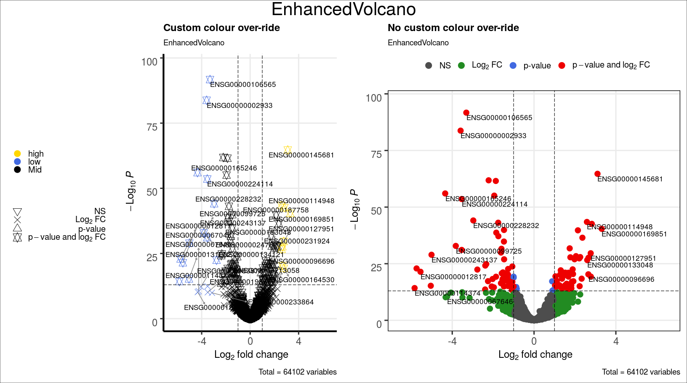

Override colouring scheme with custom key-value pairs
-----------------------------------------------------

In certain situations, one may wish to over-ride the default colour scheme with their own colour-scheme, such as colouring transcripts by pathway, cell-type or group. This can be achieved by supplying a named vector as colOverride.

In this example, we just wish to colour all transcripts with log2FC &gt; 2 as 'high' and those with log2FC &lt; -2 as 'low'.

``` r
    # create custom key-value pairs for high, low, mid expression
    keyvals <- rep("black", nrow(res2))
    names(keyvals) <- rep("Mid", nrow(res2))

    keyvals[which(res2$log2FoldChange > 2)] <- "gold"
    names(keyvals)[which(res2$log2FoldChange > 2)] <- "High"

    keyvals[which(res2$log2FoldChange < -2)] <- "royalblue"
    names(keyvals)[which(res2$log2FoldChange < -2)] <- "Low"

    unique(names(keyvals))
```

    ## [1] "Mid"  "Low"  "High"

``` r
    unique(keyvals)
```

    ## [1] "black"     "royalblue" "gold"

``` r
    p1 <- EnhancedVolcano(res2,

        title = "Over-ride",
        lab = rownames(res2),
        x = "log2FoldChange",
        y = "padj",
        selectLab = rownames(res2)[which(names(keyvals) %in% c("High", "Low"))],
        xlab = bquote(~Log[2]~ "fold change"),
        ylab = bquote(~-Log[10]~adjusted~italic(P)),
        pCutoff = 0.00000000000000001,
        FCcutoff = 1.0,
        xlim = c(-6.5,6.5),
        transcriptLabSize = 3.0,
        colAlpha = 1,
        legendPosition = "top",
        transcriptPointSize = 1.2,
        legendLabSize = 15,
        legendIconSize = 5.0,
        drawConnectors = TRUE,
        widthConnectors = 0.3,
        colConnectors = "grey50",
        border = "partial",
        borderWidth = 1.5,
        borderColour = "black",
        gridlines.major = TRUE,
        gridlines.minor = FALSE,
        colOverride = keyvals)

    p2 <- EnhancedVolcano(res2,
        title = "No over-ride",
        lab = rownames(res2),
        x = "log2FoldChange",
        y = "padj",
        selectLab = rownames(res2)[which(names(keyvals) %in% c("High", "Low"))],
        xlab = bquote(~Log[2]~ "fold change"),
        ylab = bquote(~-Log[10]~adjusted~italic(P)),
        pCutoff = 0.00000000000000001,
        FCcutoff = 1.0,
        xlim = c(-6.5,6.5),
        transcriptLabSize = 4.0,
        colAlpha = 1,
        legendPosition = "top",
        transcriptPointSize = 1.2,
        legendLabSize = 15,
        legendIconSize = 5.0,
        drawConnectors = FALSE,
        widthConnectors = 0.3,
        colConnectors = "grey50",
        border = "full",
        borderWidth = 1.0,
        borderColour = "black",
        gridlines.major = TRUE,
        gridlines.minor = FALSE,
        colOverride = NULL)

    library(gridExtra)
    library(grid)
    grid.arrange(p1, p2, ncol=2, top="EnhancedVolcano")
    grid.rect(gp=gpar(fill=NA))
```

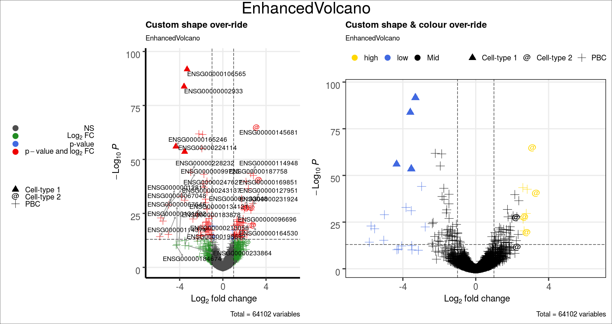

Shade certain transcripts
-------------------------

In this example we plot the same volcanos as in the previous step; however, we add an extra level of highlighting key transcripts by shading them. This feature can be used with or without colOverride = TRUE.

``` r
    # create custom key-value pairs for high, low, mid expression
    keyvals <- rep("black", nrow(res2))
    names(keyvals) <- rep("Mid", nrow(res2))

    keyvals[which(res2$log2FoldChange > 2)] <- "gold"
    names(keyvals)[which(res2$log2FoldChange > 2)] <- "High"

    keyvals[which(res2$log2FoldChange < -2)] <- "royalblue"
    names(keyvals)[which(res2$log2FoldChange < -2)] <- "Low"

    unique(names(keyvals))
```

    ## [1] "Mid"  "Low"  "High"

``` r
    unique(keyvals)
```

    ## [1] "black"     "royalblue" "gold"

``` r
    celltype1 <- c("ENSG00000106565", "ENSG00000002933",
      "ENSG00000145681")

    celltype2 <- c("ENSG00000230795", "ENSG00000164530",
      "ENSG00000143153")

    p1 <- EnhancedVolcano(res2,
        title = "Over-ride, cell-type 1",
        lab = rownames(res2),
        x = "log2FoldChange",
        y = "padj",
        selectLab = rownames(res2)[which(names(keyvals) %in% c("High", "Low"))],
        xlab = bquote(~Log[2]~ "fold change"),
        ylab = bquote(~-Log[10]~adjusted~italic(P)),
        pCutoff = 0.00000000000000001,
        FCcutoff = 1.0,
        xlim = c(-6.5,6.5),
        transcriptLabSize = 2.0,
        colAlpha = 1,
        legendPosition = "top",
        transcriptPointSize = 1.2,
        legendLabSize = 15,
        legendIconSize = 5.0,
        shade = celltype1,
        shadeLabel = "Cell-type I",
        shadeFill = "pink",
        drawConnectors = TRUE,
        widthConnectors = 0.3,
        colConnectors = "grey50",
        border = "partial",
        borderWidth = 1.5,
        borderColour = "black",
        gridlines.major = TRUE,
        gridlines.minor = FALSE,
        colOverride = keyvals)

    p2 <- EnhancedVolcano(res2,
        title = "No over-ride, cell-type 2",
        lab = rownames(res2),
        x = "log2FoldChange",
        y = "padj",
        selectLab = rownames(res2)[which(names(keyvals) %in% c("High", "Low"))],
        xlab = bquote(~Log[2]~ "fold change"),
        ylab = bquote(~-Log[10]~adjusted~italic(P)),
        pCutoff = 0.00000000000000001,
        FCcutoff = 1.0,
        xlim = c(-6.5,6.5),
        transcriptLabSize = 4.0,
        colAlpha = 1,
        legendPosition = "top",
        transcriptPointSize = 1.2,
        legendLabSize = 15,
        legendIconSize = 5.0,
        shade = celltype2,
        shadeLabel = "Cell-type II",
        drawConnectors = FALSE,
        widthConnectors = 0.5,
        colConnectors = "grey50",
        border = "full",
        borderWidth = 1.0,
        borderColour = "black",
        gridlines.major = TRUE,
        gridlines.minor = FALSE,
        colOverride = NULL)

    library(gridExtra)
    library(grid)
    grid.arrange(p1, p2, ncol=2, top="EnhancedVolcano")
    grid.rect(gp=gpar(fill=NA))
```

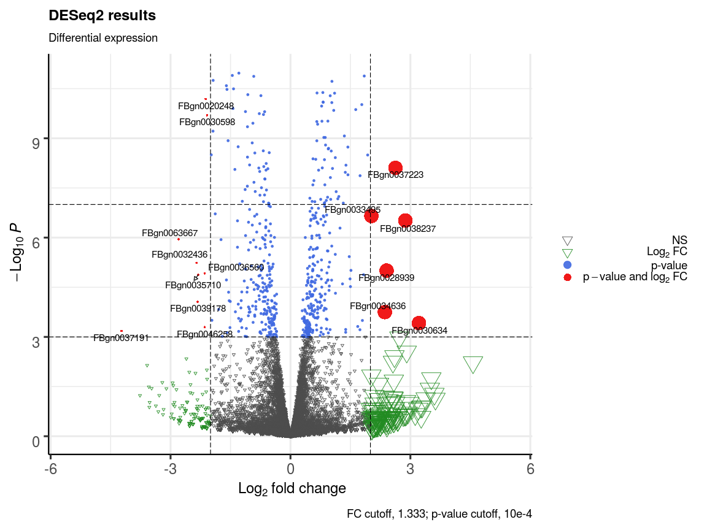

Acknowledgments
===============

The development of *EnhancedVolcano* has benefited from contributions and suggestions from:

Sharmila Rana,

[Myles Lewis](https://www.qmul.ac.uk/whri/people/academic-staff/items/lewismyles.html),

Luke Dow - Assistant Professor at Weill Cornell Medicine,

Tokhir Dadaev - Institute of Cancer Research

Session info
============

``` r
sessionInfo()
```

    ## R version 3.5.2 (2018-12-20)
    ## Platform: x86_64-pc-linux-gnu (64-bit)
    ## Running under: Ubuntu 16.04.5 LTS
    ## 
    ## Matrix products: default
    ## BLAS: /usr/lib/atlas-base/atlas/libblas.so.3.0
    ## LAPACK: /usr/lib/atlas-base/atlas/liblapack.so.3.0
    ## 
    ## locale:
    ##  [1] LC_CTYPE=pt_BR.UTF-8       LC_NUMERIC=C              
    ##  [3] LC_TIME=en_GB.UTF-8        LC_COLLATE=pt_BR.UTF-8    
    ##  [5] LC_MONETARY=en_GB.UTF-8    LC_MESSAGES=pt_BR.UTF-8   
    ##  [7] LC_PAPER=en_GB.UTF-8       LC_NAME=C                 
    ##  [9] LC_ADDRESS=C               LC_TELEPHONE=C            
    ## [11] LC_MEASUREMENT=en_GB.UTF-8 LC_IDENTIFICATION=C       
    ## 
    ## attached base packages:
    ##  [1] grid      parallel  stats4    stats     graphics  grDevices utils    
    ##  [8] datasets  methods   base     
    ## 
    ## other attached packages:
    ##  [1] gridExtra_2.3               DESeq2_1.22.2              
    ##  [3] magrittr_1.5                airway_1.2.0               
    ##  [5] SummarizedExperiment_1.12.0 DelayedArray_0.8.0         
    ##  [7] BiocParallel_1.16.5         matrixStats_0.54.0         
    ##  [9] Biobase_2.42.0              GenomicRanges_1.34.0       
    ## [11] GenomeInfoDb_1.18.1         IRanges_2.16.0             
    ## [13] S4Vectors_0.20.1            BiocGenerics_0.28.0        
    ## [15] EnhancedVolcano_1.1.3       ggrepel_0.8.0              
    ## [17] ggplot2_3.1.0               knitr_1.21                 
    ## 
    ## loaded via a namespace (and not attached):
    ##  [1] bit64_0.9-7            splines_3.5.2          Formula_1.2-3         
    ##  [4] assertthat_0.2.0       highr_0.7              latticeExtra_0.6-28   
    ##  [7] blob_1.1.1             GenomeInfoDbData_1.2.0 yaml_2.2.0            
    ## [10] RSQLite_2.1.1          pillar_1.3.1           backports_1.1.3       
    ## [13] lattice_0.20-38        glue_1.3.0             digest_0.6.18         
    ## [16] RColorBrewer_1.1-2     XVector_0.22.0         checkmate_1.9.1       
    ## [19] colorspace_1.4-0       htmltools_0.3.6        Matrix_1.2-15         
    ## [22] plyr_1.8.4             XML_3.98-1.16          pkgconfig_2.0.2       
    ## [25] genefilter_1.64.0      zlibbioc_1.28.0        xtable_1.8-3          
    ## [28] purrr_0.2.5            scales_1.0.0           annotate_1.60.0       
    ## [31] tibble_2.0.1           htmlTable_1.13.1       withr_2.1.2           
    ## [34] nnet_7.3-12            lazyeval_0.2.1         survival_2.43-3       
    ## [37] crayon_1.3.4           memoise_1.1.0          evaluate_0.12         
    ## [40] MASS_7.3-51.1          foreign_0.8-71         tools_3.5.2           
    ## [43] data.table_1.12.0      stringr_1.3.1          locfit_1.5-9.1        
    ## [46] munsell_0.5.0          cluster_2.0.7-1        AnnotationDbi_1.44.0  
    ## [49] bindrcpp_0.2.2         compiler_3.5.2         rlang_0.3.1           
    ## [52] RCurl_1.95-4.11        rstudioapi_0.9.0       htmlwidgets_1.3       
    ## [55] labeling_0.3           bitops_1.0-6           base64enc_0.1-3       
    ## [58] rmarkdown_1.11.3       gtable_0.2.0           DBI_1.0.0             
    ## [61] R6_2.3.0               dplyr_0.7.8            bit_1.1-14            
    ## [64] bindr_0.1.1            Hmisc_4.1-1            stringi_1.2.4         
    ## [67] Rcpp_1.0.0             geneplotter_1.60.0     rpart_4.1-13          
    ## [70] acepack_1.4.1          tidyselect_0.2.5       xfun_0.4

References
----------

Blighe (2018)

Blighe, Kevin. 2018. “EnhancedVolcano: Publication-ready volcano plots with enhanced colouring and labeling.” <https://github.com/kevinblighe>.
