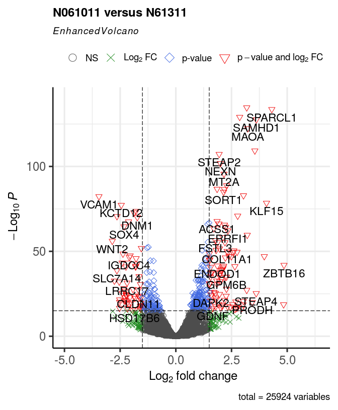
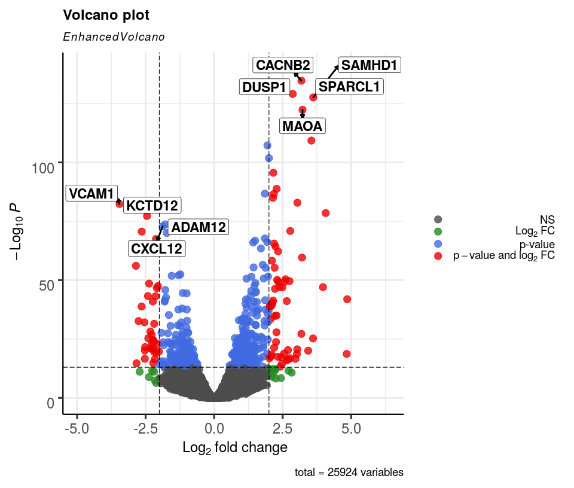
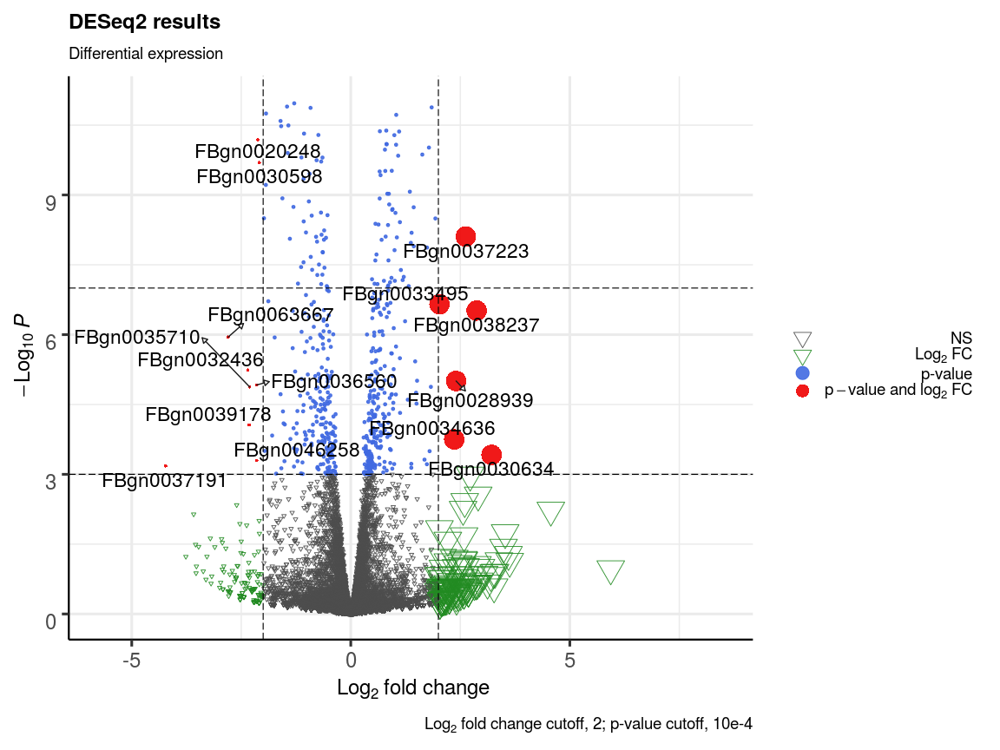
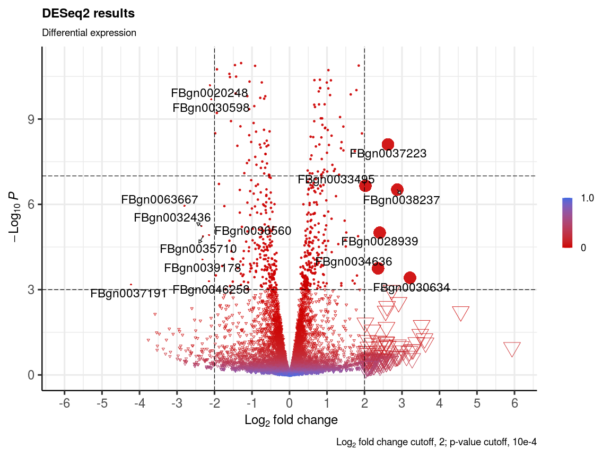

EnhancedVolcano: publication-ready volcano plots with enhanced colouring
and labeling
================
Kevin Blighe, Sharmila Rana, Myles Lewis
2021-07-23

# Introduction

Volcano plots represent a useful way to visualise the results of
differential expression analyses. Here, we present a highly-configurable
function that produces publication-ready volcano plots. EnhancedVolcano
(Blighe, Rana, and Lewis 2018) will attempt to fit as many labels in the
plot window as possible, thus avoiding ‘clogging’ up the plot with
labels that could not otherwise have been read. Other functionality
allows the user to identify up to 5 different types of attributes in the
same plot space via colour, shape, size, encircling, and shade parameter
configurations.

# Installation

## 1\. Download the package from Bioconductor

``` r
  if (!requireNamespace('BiocManager', quietly = TRUE))
    install.packages('BiocManager')

  BiocManager::install('EnhancedVolcano')
```

Note: to install development version:

``` r
  devtools::install_github('kevinblighe/EnhancedVolcano')
```

## 2\. Load the package into R session

``` r
  library(EnhancedVolcano)
```

# Quick start

For this example, we will follow the tutorial (from Section 3.1) of
[RNA-seq workflow: gene-level exploratory analysis and differential
expression](http://master.bioconductor.org/packages/release/workflows/vignettes/rnaseqGene/inst/doc/rnaseqGene.html).
Specifically, we will load the ‘airway’ data, where different airway
smooth muscle cells were treated with dexamethasone.

``` r
  library(airway)
  library(magrittr)

  data('airway')
  airway$dex %<>% relevel('untrt')
```

Annotate the Ensembl gene IDs to gene symbols:

``` r
  ens <- rownames(airway)

  library(org.Hs.eg.db)
  symbols <- mapIds(org.Hs.eg.db, keys = ens,
    column = c('SYMBOL'), keytype = 'ENSEMBL')
  symbols <- symbols[!is.na(symbols)]
  symbols <- symbols[match(rownames(airway), names(symbols))]
  rownames(airway) <- symbols
  keep <- !is.na(rownames(airway))
  airway <- airway[keep,]
```

Conduct differential expression using DESeq2 in order to create 2 sets
of results:

``` r
  library('DESeq2')

  dds <- DESeqDataSet(airway, design = ~ cell + dex)
  dds <- DESeq(dds, betaPrior=FALSE)
  res <- results(dds,
    contrast = c('dex','trt','untrt'))
  res <- lfcShrink(dds,
    contrast = c('dex','trt','untrt'), res=res, type = 'normal')
```

## Plot the most basic volcano plot

For the most basic volcano plot, only a single data-frame, data-matrix,
or tibble of test results is required, containing point labels, log2FC,
and adjusted or unadjusted P values. The default cut-off for log2FC is
\>|2|; the default cut-off for P value is 10e-6.

``` r
  EnhancedVolcano(res,
    lab = rownames(res),
    x = 'log2FoldChange',
    y = 'pvalue')
```


# Advanced features

Virtually all aspects of an EnhancedVolcano plot can be configured for
the purposes of accommodating all types of statistical distributions and
labelling preferences. By default, EnhancedVolcano will only attempt to
label genes that pass the thresholds that you set for statistical
significance, i.e., ‘pCutoff’ and ‘FCcutoff’. In addition, it will only
label as many of these that can reasonably fit in the plot space. The
user can optionally supply a vector of labels (as ‘selectLab’) that s/he
wishes to label in the
plot.

## Modify cut-offs for log2FC and P value; specify title; adjust point and label size

The default P value cut-off of 10e-6 may be too relaxed for most
studies, which may therefore necessitate increasing this threshold by a
few orders of magnitude. Equally, the log2FC cut-offs may be too
stringent, given that moderated ‘shrunk’ estimates of log2FC differences
in differential expression analysis can now be calculated.

In this example, we also modify the point and label size, which can help
to improve clarity where many variables went into the differential
expression analysis.

``` r
  EnhancedVolcano(res,
    lab = rownames(res),
    x = 'log2FoldChange',
    y = 'pvalue',
    title = 'N061011 versus N61311',
    pCutoff = 10e-32,
    FCcutoff = 0.5,
    pointSize = 3.0,
    labSize = 6.0)
```


## Adjust colour and alpha for point shading

The default colour scheme may not be to everyone’s taste. Here we make
it such that only the variables passing both the log2FC and P value
thresholds are coloured red, with everything else black. We also adjust
the value for ‘alpha’, which controls the transparency of the plotted
points: 1 = 100% opaque; 0 = 100% transparent.

``` r
  EnhancedVolcano(res,
    lab = rownames(res),
    x = 'log2FoldChange',
    y = 'pvalue',
    title = 'N061011 versus N61311',
    pCutoff = 10e-16,
    FCcutoff = 1.5,
    pointSize = 3.0,
    labSize = 6.0,
    col=c('black', 'black', 'black', 'red3'),
    colAlpha = 1)
```


## Adjust shape of plotted points

It can help, visually, to also plot different points as different
shapes. The default shape is a circle. The user can specify their own
shape encoding via the ‘shape’ parameter, which accepts either a single
or four possible values: if four values, these then map to the standard
designation that is also assigned by the colours; if a single value, all
points are shaped with this value.

For more information on shape encoding search online at [ggplot2 Quick
Reference: shape](http://sape.inf.usi.ch/quick-reference/ggplot2/shape)

``` r
 EnhancedVolcano(res,
    lab = rownames(res),
    x = 'log2FoldChange',
    y = 'pvalue',
    title = 'N061011 versus N61311',
    pCutoff = 10e-16,
    FCcutoff = 1.5,
    pointSize = 4.0,
    labSize = 6.0,
    shape = 8,
    colAlpha = 1)
```

``` r
  EnhancedVolcano(res,
    lab = rownames(res),
    x = 'log2FoldChange',
    y = 'pvalue',
    title = 'N061011 versus N61311',
    pCutoff = 10e-16,
    FCcutoff = 1.5,
    pointSize = 3.0,
    labSize = 6.0,
    shape = c(1, 4, 23, 25),
    colAlpha = 1)
```



## Adjust cut-off lines and add extra threshold lines

The lines that are drawn to indicate cut-off points are also modifiable.
The parameter ‘cutoffLineType’ accepts the following values: “blank”,
“solid”, “dashed”, “dotted”, “dotdash”, “longdash”, and “twodash”. The
colour and thickness of these can also be modified with ‘cutoffLineCol’
and ‘cutoffLineWidth’. To disable the lines, set either
cutoffLineType=“blank” or cutoffLineWidth=0.

Extra lines can also be added via ‘hline’ and ‘vline’ to display other
cut-offs.

To make these more visible, we will also remove the default gridlines.

``` r
  EnhancedVolcano(res,
    lab = rownames(res),
    x = 'log2FoldChange',
    y = 'pvalue',
    xlim = c(-6, 6),
    title = 'N061011 versus N61311',
    pCutoff = 10e-12,
    FCcutoff = 1.5,
    pointSize = 3.0,
    labSize = 6.0,
    colAlpha = 1,
    cutoffLineType = 'blank',
    cutoffLineCol = 'black',
    cutoffLineWidth = 0.8,
    hline = c(10e-20,
      10e-20 * 10e-30,
      10e-20 * 10e-60,
      10e-20 * 10e-90),
    hlineCol = c('pink', 'hotpink', 'purple', 'black'),
    hlineType = c('solid', 'longdash', 'dotdash', 'dotted'),
    hlineWidth = c(1.0, 1.5, 2.0, 2.5),
    gridlines.major = FALSE,
    gridlines.minor = FALSE)
```


## Adjust legend position, size, and text

The position of the legend can also be changed to “left” or “right” (and
stacked vertically), or ‘top’ or “bottom” (stacked horizontally). The
legend text, label size, and icon size can also be modified.

``` r
  EnhancedVolcano(res,
    lab = rownames(res),
    x = 'log2FoldChange',
    y = 'pvalue',
    pCutoff = 10e-12,
    FCcutoff = 1.5,
    cutoffLineType = 'twodash',
    cutoffLineWidth = 0.8,
    pointSize = 4.0,
    labSize = 6.0,
    colAlpha = 1,
    legendLabels=c('Not sig.','Log (base 2) FC','p-value',
      'p-value & Log (base 2) FC'),
    legendPosition = 'right',
    legendLabSize = 16,
    legendIconSize = 5.0)
```


Note: to make the legend completely invisible, specify:

``` r
legendPosition = 'none'
```

## Fit more labels by adding connectors

In order to maximise free space in the plot window, one can fit more
labels by adding connectors from labels to points, where appropriate.
The width and colour of these connectors can also be modified with
‘widthConnectors’ and ‘colConnectors’, respectively. Further
configuration is achievable via ‘typeConnectors’ (“open”, “closed”),
‘endsConnectors’ (“last”, “first”, “both”), and lengthConnectors
(default = unit(0.01, ‘npc’)).

The result may not always be desirable as it can make the plot look
overcrowded.

``` r
  EnhancedVolcano(res,
    lab = rownames(res),
    x = 'log2FoldChange',
    y = 'pvalue',
    xlab = bquote(~Log[2]~ 'fold change'),
    pCutoff = 10e-32,
    FCcutoff = 2.0,
    pointSize = 4.0,
    labSize = 6.0,
    colAlpha = 1,
    legendPosition = 'right',
    legendLabSize = 12,
    legendIconSize = 4.0,
    drawConnectors = TRUE,
    widthConnectors = 0.75)
```


## Only label key variables

In many situations, people may only wish to label their key variables /
variables of interest. One can therefore supply a vector of these
variables via the ‘selectLab’ parameter, the contents of which have to
also be present in the vector passed to ‘lab’.

``` r
  EnhancedVolcano(res,
    lab = rownames(res),
    x = 'log2FoldChange',
    y = 'pvalue',
    selectLab = c('TMEM176B','ADH1A'),
    xlab = bquote(~Log[2]~ 'fold change'),
    pCutoff = 10e-14,
    FCcutoff = 2.0,
    pointSize = 4.0,
    labSize = 6.0,
    shape = c(4, 35, 17, 18),
    colAlpha = 1,
    legendPosition = 'right',
    legendLabSize = 14,
    legendIconSize = 5.0)
```

## Draw labels in boxes

To improve label clarity, we can draw simple boxes around the plot’s
labels via *boxedLabels*. This works much better when drawConnectors is
also TRUE.

``` r
  EnhancedVolcano(res,
    lab = rownames(res),
    x = 'log2FoldChange',
    y = 'pvalue',
    selectLab = c('VCAM1','KCTD12','ADAM12',
      'CXCL12','CACNB2','SPARCL1','DUSP1','SAMHD1','MAOA'),
    xlab = bquote(~Log[2]~ 'fold change'),
    pCutoff = 10e-14,
    FCcutoff = 2.0,
    pointSize = 4.0,
    labSize = 6.0,
    labCol = 'black',
    labFace = 'bold',
    boxedLabels = TRUE,
    colAlpha = 4/5,
    legendPosition = 'right',
    legendLabSize = 14,
    legendIconSize = 4.0,
    drawConnectors = TRUE,
    widthConnectors = 1.0,
    colConnectors = 'black')
```



## Italicise labels and flip volcano on it’s side

To make the labels italic, we can create a new vector in which we encode
the labels as follows: *italic(‘\[LABEL\]’)*. By then setting
*parseLabels = TRUE*, these will be parsed by the internal *ggplot2* or
*ggrepel* engine and presented as italicised text. Advanced users can
encode any expression as the label, which will then also be parsed.

To flip the volcano on its side, we just use *EnhancedVolcano(…) +
coord\_flip()*.

``` r
  lab_italics <- paste0("italic('", rownames(res), "')")
  selectLab_italics = paste0(
    "italic('",
    c('VCAM1','KCTD12','ADAM12', 'CXCL12','CACNB2','SPARCL1','DUSP1','SAMHD1','MAOA'),
    "')")

  EnhancedVolcano(res,
    lab = lab_italics,
    x = 'log2FoldChange',
    y = 'pvalue',
    selectLab = selectLab_italics,
    xlab = bquote(~Log[2]~ 'fold change'),
    pCutoff = 10e-14,
    FCcutoff = 1.0,
    pointSize = 3.0,
    labSize = 6.0,
    labCol = 'black',
    labFace = 'bold',
    boxedLabels = TRUE,
    parseLabels = TRUE,
    col = c('black', 'pink', 'purple', 'red3'),
    colAlpha = 4/5,
    legendPosition = 'bottom',
    legendLabSize = 14,
    legendIconSize = 4.0,
    drawConnectors = TRUE,
    widthConnectors = 1.0,
    colConnectors = 'black') + coord_flip()
```


## Over-ride colouring scheme with custom key-value pairs

In certain situations, one may wish to over-ride the default colour
scheme with their own colour-scheme, such as colouring variables by
pathway, cell-type or group. This can be achieved by supplying a named
vector as ‘colCustom’.

In this example, we just wish to colour all variables with log2FC \> 2.5
as ‘high’ and those with log2FC \< -2.5 as
‘low’.

``` r
  # create custom key-value pairs for 'high', 'low', 'mid' expression by fold-change
  # this can be achieved with nested ifelse statements
  keyvals <- ifelse(
    res$log2FoldChange < -2.5, 'royalblue',
      ifelse(res$log2FoldChange > 2.5, 'gold',
        'black'))
  keyvals[is.na(keyvals)] <- 'black'
  names(keyvals)[keyvals == 'gold'] <- 'high'
  names(keyvals)[keyvals == 'black'] <- 'mid'
  names(keyvals)[keyvals == 'royalblue'] <- 'low'
```

``` r
  EnhancedVolcano(res,
    lab = rownames(res),
    x = 'log2FoldChange',
    y = 'pvalue',
    selectLab = rownames(res)[which(names(keyvals) %in% c('high', 'low'))],
    xlab = bquote(~Log[2]~ 'fold change'),
    title = 'Custom colour over-ride',
    pCutoff = 10e-14,
    FCcutoff = 1.0,
    pointSize = 3.5,
    labSize = 4.5,
    shape = c(6, 4, 2, 11),
    colCustom = keyvals,
    colAlpha = 1,
    legendPosition = 'left',
    legendLabSize = 15,
    legendIconSize = 5.0,
    drawConnectors = TRUE,
    widthConnectors = 1.0,
    colConnectors = 'black',
    arrowheads = FALSE,
    gridlines.major = TRUE,
    gridlines.minor = FALSE,
    border = 'partial',
    borderWidth = 1.5,
    borderColour = 'black')
```


## Over-ride colour and/or shape scheme with custom key-value pairs

In this example, we first over-ride the existing shape scheme and then
both the colour and shape scheme at the same time.

``` r
  # define different cell-types that will be shaded
  celltype1 <- c('VCAM1','KCTD12','ADAM12','CXCL12')
  celltype2 <- c('CACNB2','SPARCL1','DUSP1','SAMHD1','MAOA')

  # create custom key-value pairs for different cell-types
  # this can be achieved with nested ifelse statements
  keyvals.shape <- ifelse(
    rownames(res) %in% celltype1, 17,
      ifelse(rownames(res) %in% celltype2, 64,
        3))
  keyvals.shape[is.na(keyvals.shape)] <- 3
  names(keyvals.shape)[keyvals.shape == 3] <- 'PBMC'
  names(keyvals.shape)[keyvals.shape == 17] <- 'Cell-type 1'
  names(keyvals.shape)[keyvals.shape == 64] <- 'Cell-type 2'
```

``` r
  p1 <- EnhancedVolcano(res,
    lab = rownames(res),
    x = 'log2FoldChange',
    y = 'pvalue',
    selectLab = rownames(res)[which(names(keyvals) %in% c('high', 'low'))],
    xlab = bquote(~Log[2]~ 'fold change'),
    title = 'Custom shape over-ride',
    pCutoff = 10e-14,
    FCcutoff = 1.0,
    pointSize = 4.5,
    labSize = 4.5,
    shapeCustom = keyvals.shape,
    colCustom = NULL,
    colAlpha = 1,
    legendLabSize = 15,
    legendPosition = 'left',
    legendIconSize = 5.0,
    drawConnectors = TRUE,
    widthConnectors = 0.5,
    colConnectors = 'grey50',
    gridlines.major = TRUE,
    gridlines.minor = FALSE,
    border = 'partial',
    borderWidth = 1.5,
    borderColour = 'black')

  # create custom key-value pairs for 'high', 'low', 'mid' expression by fold-change
  # this can be achieved with nested ifelse statements
  keyvals.colour <- ifelse(
    res$log2FoldChange < -2.5, 'royalblue',
      ifelse(res$log2FoldChange > 2.5, 'gold',
        'black'))
  keyvals.colour[is.na(keyvals.colour)] <- 'black'
  names(keyvals.colour)[keyvals.colour == 'gold'] <- 'high'
  names(keyvals.colour)[keyvals.colour == 'black'] <- 'mid'
  names(keyvals.colour)[keyvals.colour == 'royalblue'] <- 'low'

  p2 <- EnhancedVolcano(res,
    lab = rownames(res),
    x = 'log2FoldChange',
    y = 'pvalue',
    selectLab = rownames(res)[which(names(keyvals) %in% c('High', 'Low'))],
    xlab = bquote(~Log[2]~ 'fold change'),
    title = 'Custom shape & colour over-ride',
    pCutoff = 10e-14,
    FCcutoff = 1.0,
    pointSize = 5.5,
    labSize = 0.0,
    shapeCustom = keyvals.shape,
    colCustom = keyvals.colour,
    colAlpha = 1,
    legendPosition = 'right',
    legendLabSize = 15,
    legendIconSize = 5.0,
    drawConnectors = TRUE,
    widthConnectors = 0.5,
    colConnectors = 'grey50',
    gridlines.major = TRUE,
    gridlines.minor = FALSE,
    border = 'full',
    borderWidth = 1.0,
    borderColour = 'black')

  library(gridExtra)
  library(grid)
  grid.arrange(p1, p2,
    ncol=2,
    top = textGrob('EnhancedVolcano',
      just = c('center'),
      gp = gpar(fontsize = 32)))
```


## Encircle / highlight certain variables

In this example we add an extra level of identifying key variables by
encircling them.

This feature works best for shading just 1 or 2 key variables. It is
expected that the user can use the ‘shapeCustom’ parameter for more in
depth identification of different types of variables.

``` r
  # define different cell-types that will be shaded
  celltype1 <- c('VCAM1','CXCL12')
  celltype2 <- c('SORT1', 'KLF15')
```

``` r
  EnhancedVolcano(res,
    lab = rownames(res),
    x = 'log2FoldChange',
    y = 'pvalue',
    selectLab = c(celltype1, celltype2),
    xlab = bquote(~Log[2]~ 'fold change'),
    title = 'Shading cell-type 1|2',
    pCutoff = 10e-14,
    FCcutoff = 1.0,
    pointSize = 8.0,
    labSize = 6.0,
    labCol = 'black',
    labFace = 'bold',
    boxedLabels = TRUE,
    shape = 42,
    colCustom = keyvals,
    colAlpha = 1,
    legendPosition = 'right',
    legendLabSize = 20,
    legendIconSize = 20.0,
    # encircle
      encircle = celltype1,
      encircleCol = 'black',
      encircleSize = 2.5,
      encircleFill = 'pink',
      encircleAlpha = 1/2,
    # shade
      shade = celltype2,
      shadeAlpha = 1/2,
      shadeFill = 'skyblue',
      shadeSize = 1,
      shadeBins = 5,
    drawConnectors = TRUE,
    widthConnectors = 2.0,
    gridlines.major = TRUE,
    gridlines.minor = FALSE,
    border = 'full',
    borderWidth = 5,
    borderColour = 'black')
```



## Highlighting key variables via custom point sizes

One can also supply a vector of sizes to pointSize for the purpose of
having a different size for each poin. For example, if we want to change
the size of just those variables with log<sub>2</sub>FC\>2:

``` r
  library("pasilla")
  pasCts <- system.file("extdata", "pasilla_gene_counts.tsv",
    package="pasilla", mustWork=TRUE)
  pasAnno <- system.file("extdata", "pasilla_sample_annotation.csv",
    package="pasilla", mustWork=TRUE)
  cts <- as.matrix(read.csv(pasCts,sep="\t",row.names="gene_id"))
  coldata <- read.csv(pasAnno, row.names=1)
  coldata <- coldata[,c("condition","type")]
  rownames(coldata) <- sub("fb", "", rownames(coldata))
  cts <- cts[, rownames(coldata)]
  library("DESeq2")
  dds <- DESeqDataSetFromMatrix(countData = cts,
    colData = coldata,
    design = ~ condition)

  featureData <- data.frame(gene=rownames(cts))
  mcols(dds) <- DataFrame(mcols(dds), featureData)
  dds <- DESeq(dds)
  res <- results(dds)

  p1 <- EnhancedVolcano(res,
    lab = rownames(res),
    x = "log2FoldChange",
    y = "pvalue",
    pCutoff = 10e-4,
    FCcutoff = 2,
    ylim = c(0, -log10(10e-12)),
    pointSize = c(ifelse(res$log2FoldChange>2, 8, 1)),
    labSize = 6.0,
    shape = c(6, 6, 19, 16),
    title = "DESeq2 results",
    subtitle = "Differential expression",
    caption = bquote(~Log[2]~ "fold change cutoff, 2; p-value cutoff, 10e-4"),
    legendPosition = "right",
    legendLabSize = 14,
    col = c("grey30", "forestgreen", "royalblue", "red2"),
    colAlpha = 0.9,
    drawConnectors = TRUE,
    hline = c(10e-8),
    widthConnectors = 0.5)

  p1
```


## Change to continuous colour scheme

We can over-ride the default ‘discrete’ colour scheme with a continuous
one that shades between 2 colours based on nominal or adjusted p-value,
whichever is selected by *y*, via *colGradient*:

``` r
  p1 <- EnhancedVolcano(res,
    lab = rownames(res),
    x = "log2FoldChange",
    y = "pvalue",
    pCutoff = 10e-4,
    FCcutoff = 2,
    ylim = c(0, -log10(10e-12)),
    pointSize = c(ifelse(res$log2FoldChange>2, 8, 1)),
    labSize = 6.0,
    shape = c(6, 6, 19, 16),
    title = "DESeq2 results",
    subtitle = "Differential expression",
    caption = bquote(~Log[2]~ "fold change cutoff, 2; p-value cutoff, 10e-4"),
    legendPosition = "right",
    legendLabSize = 14,
    colAlpha = 0.9,
    colGradient = c('red3', 'royalblue'),
    drawConnectors = TRUE,
    hline = c(10e-8),
    widthConnectors = 0.5)

  p1
```


## Custom axis tick marks

Custom axis ticks can be added in a ‘plug and play’ fashion via
*ggplot2* functionality, as follows:

``` r
  p1 +
    ggplot2::coord_cartesian(xlim=c(-6, 6)) +
    ggplot2::scale_x_continuous(
      breaks=seq(-6,6, 1))
```



More information on this can be found here:
<http://www.sthda.com/english/wiki/ggplot2-axis-ticks-a-guide-to-customize-tick-marks-and-labels>

# Acknowledgments

The development of *EnhancedVolcano* has benefited from contributions
and suggestions from:

  - Luke Dow (Assistant Professor at Weill Cornell Medicine)
  - Tokhir Dadaev (Institute of Cancer Research)
  - Alina Frolova
  - Venu Thatikonda (Deutsches Krebsforschungszentrum (DKFZ) / German
    Cancer Research Center)
  - David Wheeler (Montana State University)
  - David Kulp
  - DinoFer
  - Axel Künstner
  - Anthony Doherty
  - Emir Turkes
  - Benjamin Ostendorf
  - Cristian (github.com/ccruizm)
  - Quan Le (Yale University)

# Session info

``` r
sessionInfo()
```

    ## R version 4.0.3 (2020-10-10)
    ## Platform: x86_64-pc-linux-gnu (64-bit)
    ## Running under: Ubuntu 16.04.7 LTS
    ## 
    ## Matrix products: default
    ## BLAS:   /usr/lib/atlas-base/atlas/libblas.so.3.0
    ## LAPACK: /usr/lib/atlas-base/atlas/liblapack.so.3.0
    ## 
    ## locale:
    ##  [1] LC_CTYPE=pt_BR.UTF-8       LC_NUMERIC=C              
    ##  [3] LC_TIME=en_GB.UTF-8        LC_COLLATE=pt_BR.UTF-8    
    ##  [5] LC_MONETARY=en_GB.UTF-8    LC_MESSAGES=pt_BR.UTF-8   
    ##  [7] LC_PAPER=en_GB.UTF-8       LC_NAME=C                 
    ##  [9] LC_ADDRESS=C               LC_TELEPHONE=C            
    ## [11] LC_MEASUREMENT=en_GB.UTF-8 LC_IDENTIFICATION=C       
    ## 
    ## attached base packages:
    ##  [1] grid      parallel  stats4    stats     graphics  grDevices utils    
    ##  [8] datasets  methods   base     
    ## 
    ## other attached packages:
    ##  [1] pasilla_1.16.0              gridExtra_2.3              
    ##  [3] DESeq2_1.28.1               org.Hs.eg.db_3.11.4        
    ##  [5] AnnotationDbi_1.53.0        magrittr_2.0.1             
    ##  [7] airway_1.8.0                SummarizedExperiment_1.18.2
    ##  [9] DelayedArray_0.14.1         matrixStats_0.57.0         
    ## [11] Biobase_2.48.0              GenomicRanges_1.40.0       
    ## [13] GenomeInfoDb_1.24.2         IRanges_2.22.2             
    ## [15] S4Vectors_0.26.1            BiocGenerics_0.34.0        
    ## [17] EnhancedVolcano_1.11.3      ggrepel_0.9.1              
    ## [19] ggplot2_3.3.3               knitr_1.31                 
    ## 
    ## loaded via a namespace (and not attached):
    ##  [1] bitops_1.0-6           bit64_4.0.5            ash_1.0-15            
    ##  [4] RColorBrewer_1.1-2     tools_4.0.3            R6_2.5.0              
    ##  [7] KernSmooth_2.23-18     vipor_0.4.5            DBI_1.1.1             
    ## [10] colorspace_2.0-0       withr_2.4.1            tidyselect_1.1.0      
    ## [13] ggrastr_0.2.3          ggalt_0.4.0            bit_4.0.4             
    ## [16] compiler_4.0.3         extrafontdb_1.0        isoband_0.2.3         
    ## [19] labeling_0.4.2         scales_1.1.1           proj4_1.0-10.1        
    ## [22] genefilter_1.70.0      stringr_1.4.0          digest_0.6.27         
    ## [25] rmarkdown_2.6          XVector_0.28.0         pkgconfig_2.0.3       
    ## [28] htmltools_0.5.1.1      extrafont_0.17         fastmap_1.1.0         
    ## [31] highr_0.8              maps_3.3.0             rlang_0.4.10          
    ## [34] RSQLite_2.2.3          generics_0.1.0         farver_2.0.3          
    ## [37] BiocParallel_1.22.0    dplyr_1.0.3            RCurl_1.98-1.2        
    ## [40] GenomeInfoDbData_1.2.3 Matrix_1.3-2           Rcpp_1.0.6            
    ## [43] ggbeeswarm_0.6.0       munsell_0.5.0          lifecycle_0.2.0       
    ## [46] stringi_1.5.3          yaml_2.2.1             MASS_7.3-53           
    ## [49] zlibbioc_1.34.0        blob_1.2.1             crayon_1.3.4          
    ## [52] lattice_0.20-41        splines_4.0.3          annotate_1.66.0       
    ## [55] locfit_1.5-9.4         pillar_1.4.7           geneplotter_1.66.0    
    ## [58] XML_3.99-0.5           glue_1.4.2             evaluate_0.14         
    ## [61] vctrs_0.3.6            Rttf2pt1_1.3.8         gtable_0.3.0          
    ## [64] purrr_0.3.4            assertthat_0.2.1       cachem_1.0.1          
    ## [67] xfun_0.20              xtable_1.8-4           survival_3.2-7        
    ## [70] tibble_3.0.1           beeswarm_0.2.3         memoise_2.0.0         
    ## [73] ellipsis_0.3.1

# References

Blighe, Rana, and Lewis (2018)

<div id="refs" class="references">

<div id="ref-EnhancedVolcano">

Blighe, K, S Rana, and M Lewis. 2018. “EnhancedVolcano:
Publication-ready volcano plots with enhanced colouring and labeling.”
<https://github.com/kevinblighe/EnhancedVolcano.>

</div>

</div>
